# Imagine

A graphical interface for recording with OCPI microscopes..

## Installation

1. Install Visual Studio 2015
   - make sure you installed "common tools" when you install

2. Install QT5
   - make sure the version of QT is for 64bit

3. Install QT add-in for vc2015
   - install add-in
   - go to QT VS Tools tab in visual studio and set the right directory
	* for vc2017 and Qt5.11 : set this as C:\Qt\5.11.2\msvc2017_64

4. Install QWT v6.1.3
   - open the Visual Studio tools directory under the windows Start menu, select "Developer's command prompt"(run as admintrator)
   ```
   	> cd VC
   	> vcvarsall amd64
   	> cd [qwt directory (extract .zip to c:\ then it will create Qwt-6.1.3 directory)]
   	> C:\Qt_5_7\5.7\msvc2015_64\bin\qmake qwt.pro
   	> nmake (if you recompile everything again, C:\Qwt-6.1.3\src\release directory should be clear)
   	> nmake install
   ```	
   - add an environment variable QWTDIR as C:\qwt-6.1.3

5. Install Boost v1.57.0
   - extract .zip file to c:\Program Files\boost
   - open the Visual Studio tools directory under the Start   
     menu, select "Developer's command prompt"(run as administrator)
     ```
       > cd c:\Program Files\boost\boost_1_57_0
       > bootstrap.bat
       > .\b2 address-model=64 toolset=msvc-12.0
     ```
     
6. Install camera SDK
   - run SW_PCOSDKWIN_123
   - Choose interface type
	ex) Silicon Software Dll MeIV or Camera Link HS
   - Setup target project of visual studio : open project and bring up property page
	Configuration Properties
		C/C++>General>Additional>Include Directories
		
		    C:\Users\user\AppData\Roaming\Digital Camera Toolbox\pco.sdk\include
		    
		Linker/General/Additional/Library Directories
		
		    C:\Users\user\AppData\Roaming\Digital Camera Toolbox\pco.sdk\lib64
		
		    C:\Users\user\AppData\Roaming\Digital Camera Toolbox\pco.sdk\bin64
		
		Linker/Input/Additional/Dependencies
		
		    SC2_cam.lib

7. Install NI(National Instrument) DAQ driver
   - Setup target project of visual studio : open project and bring up property page
	Configuration Properties
		C/C++/General/Additional/Include Directories
		
		    C:\Program Files (x86)\National Instruments\NI-DAQ\DAQmx ANSI C Dev\include
					
		Linker/General/Additional/Library Directories
		
		    C:\Program Files (x86)\National Instruments\Shared\ExternalCompilerSupport\C\lib64\msvc

		Linker/Input/Additional/Dependencies

		    NIDAQmx.lib

8. Modify some items in the preference of Imagine project, if the directory of camera sdk installation is changed from the OCPI's setting.
   - include dir : .....pco.edge\include
   - additional library dir : ...pco.edge\lib64
					   ...pco.edge\bin64(need this?)
   - additional dependency : ...\lib64\sc2_cam.lib

9. Install FFTW for frequency analysis of piezo control waveform
    - Download FFTW 3.3.5 Windows : ftp://ftp.fftw.org/pub/fftw/fftw-3.3.5-dll64.zip
    - unzip and copy to c:\FFTW
    - Open the Visual Studio Developer Command prompt
	Start -> All Apps -> Visual Studio 2015 -> Developer Command prompt
	Or, run
	C:\Program Files (x86)\Microsoft Visual Studio 14.0\Common7\Tools\VsDevCmd.bat
    - Produce .lib file : Navigate to the unzip location and type
	lib /machine:x64 /def:libfftw3-3.def
	lib /machine:x64 /def:libfftw3f-3.def
	lib /machine:x64 /def:libfftw3l-3.def
    - Setup visual studio : open project and bring up property page
	Configuration Properties
		C/C++/General/Additional/Include Directories
		
		    C:\FFTW
		    
		Linker/General/Additional/Library Directories
		
		    C:\FFTW
		    
		Linker/Input/Additional/Dependencies
		
		    libfftw3-3.lib, libfftw3f-3.lib, libfftw3l-3.lib

10. Copy all files needed in the output directory and 'Working Directory' (Specified in Configuration Properties>Debugging>Working Directory)
   - Camera related dlls : SC2_Cam.dll, sc2_clhs.dll(REALM), sc2_cl_me4.dll(OCPI)
   - QT related dlls : Qt5Core.dll, Qt5Gui.dll, Qt5OpenGL.dll,
         Qt5PrintSupport.dll, Qt5Script.dll, Qt5SerialPort.dll,
         Qt5Svg.dll, Qt5Widgets.dll
   - QWT related dll : qwt.dll
   - FFTW related dll : libfftw3-3.dll, libfftw3f-3.dll, libfftw3l-3.dll
   - JavaScript files : imagine.js, 'related rig name'.js


## Usage

### OCPI Operation Modes

- Parameter control mode
- Waveform control mode
- Script control mode

1. Parameter and waveform control modes

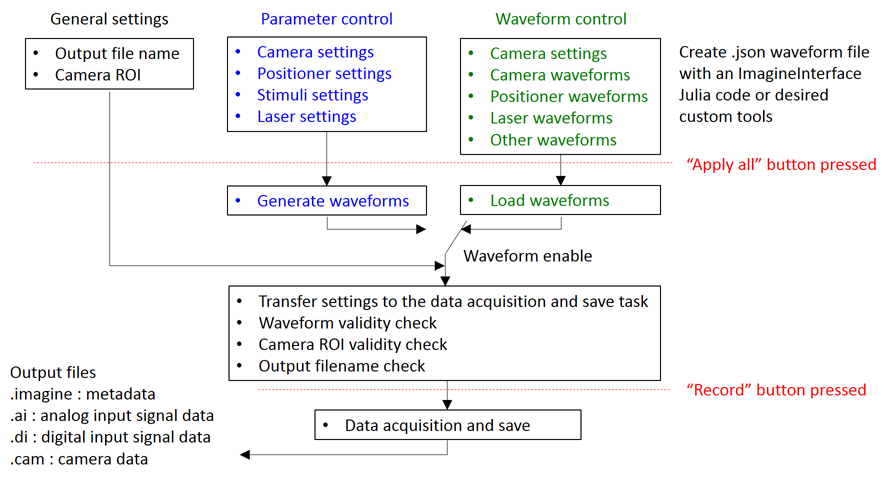

2. Script control mode
In the script control mode, we can execute a java script code in the Imagine. In addition, Imagine provides several java functions for user to access some essential operations which are used to record data. Thereby, we can execute several experiments according to the control flow specified with java script code by one execution without intervention.

In the Imagine GUI, general settings, parameter control settings and .json file name for waveform control can be saved in an configuration file with a ‘save configuration’ command in file menu. In script control mode, we can load, verify and record with this configuration file.


### Graphic User Interface


Imagine GUI is composed with several sections as listed below with numbers corresponding the numbers in the above image.

1: Parameters and display control window
2: Display window
3: Log window
4: Stimuli window
5: Main menu
Typical work flow is as follows.

a. Prepare sepecimen
b. Caputure full live image with a "live" button
c. Set parameters of display : intensity scale, zoom region, etc
d. Set parameters for an experiment : camera, positioner, laser, stimuli, output filename, etc
e. Press "Apply all" button : This varifies if the setting parameters are valid. If not, Imagine rejects the settings
f. Start acquisition : If the parameters are valid, we can start acquistion by clicking a "record" button.
g. Inspect the acquired data : Once the acquisition is end, we can varify the acquisition if it is ended normally or interrupted by some errors, Using "display" tab and "AI and DI" tab, we can varify that and also briefly check if we got the desired data.

1. Parameters and display control window
This window is designed for setting overall parameters for the microscope operation and display. This window consists of tree main sections which are "Config and control", "Histogram" and "Intensity". Currently, "Intensity" tab is not used. "Histogram" section displays histogram of an image displayed in "Display window". "Config and control" tab is designed for setting overall parameters such as camera control, postioner control, laser control and stimuli control which are used to config an experiment. Also, it provides some basic tools for the following inspection of acquired data.

2. Display window
This window displays live images from the cameras attaced to the microscope or captured images during the acqusition or after the acquisition by loading the '.imagine' file at the "Display" tab. In this window, we can zoom the image. This zoomed region can be set as a soft ROI region at the "camera" tab.

3. Log window
This window displays log messages.

4. Stimuli window
This window makes a list of stimulus numbers according to the stack numbers when we load stimuli file. Details are explained in the explanation of "Stimuli" tab.

5. Main menu
Details are explained in the explanation of main menu page.


### Main Menu

1. File menu

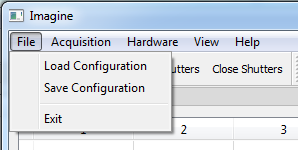

We can save a current configuration and load it later using this menu.

2. Acquisition menu

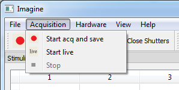

We can start aquisition or live displaying the images from the cameras.

3. Hardware menu

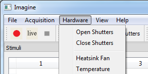

We can open and close a laser shutter of laser. "Heatsink Fan" and "Temperature" menus are not usable currently.

4. View menu

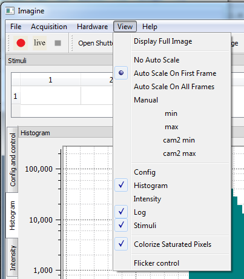

Display Full Image : this menu make the camera ROI as full resion.
No Auto Scale : does not apply auto scale to the intensity of the captured images in displaying them.
Auto Scale On First Frame : applies auto scale to the first frame image of a stack. And following frames are scaled with the scale factor of the first frame of the stack which they are belonged.
Auto Scale On All Frames : apllies auto scale to the every frame of the capture images.
Manual : enables users to set the scale manually. Intensity from "min" value and "max" value will be scaled to 0 to 255. If we overlap the camera1 iamge with the camera2 iamge, "cam2 min" and "cam2 max" can be used to set the minimum and maximum intensity value of the camera2 image.
Colorize Saturated Pixels : enables display to indicate the saturated pixel with some colors. Blue color pixels indicates pixels which have minus intensity value after scaling. Red is for pixels having intensity over 256.
Flicker control : reduces the flicker caused by abnormal black frames between normal frames.

### Parameters and display control window

1. General tab


This tab is designed for setting the location and filename of output file and adding some comments about the paramter setting of this experiment. These settings and comments can be saved in a configuration file which will be created by clicking the "Save Configuration" item in "File" menu.

2. Camera tab

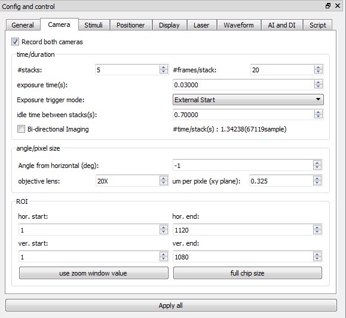

Record both cameras : eables to record both cameras.
number of stacks : sets the number of stacks.
number of frames/stack : sets the number of frames in a stack.
exposure time(s) : set exposure time. This value is valid only for "External Start" mode in exposure trigger mode.
exposure trigger mode : selects exposure trigger mode. Refer to the explanation in the exposure trigger mode section.
idle time between stacks(s) : sets idle time between stacks.
bi-directional imaging : makes an acquition enable during the positioner travel back time also. Refer to the bi-directional imaging waveform below.
angle from horizontal(deg) : specifies angle between objective lens and horizontal plain. This is just used as an information.
objective lens : secifies zoom factor of the objective lens. This is just used as an information.
um per pixel (xy plane) : secifies pixel size. This can be also calculated from the zoom factor. This is just used as an information.
hor. start : sets the horizontal start of the sensor ROI or displays horizontal start of the soft ROI when we press "use zoom window value" button. Refer to the ROI section.
hor. end : sets the horizontal end of the sensor ROI or displays horizontal end of the soft ROI when we press "use zoom window value" button.
ver. start : sets the vertical start of the sensor ROI or displays vertical start of the soft ROI when we press "use zoom window value" button.
ver. end : sets the vertical end of the sensor ROI or displays vertical end of the soft ROI when we press "use zoom window value" button.
use zoom window value : enables soft ROI with the region selected by zoom window.
full chip size : enable full size imaging.

3. Stimuli tab
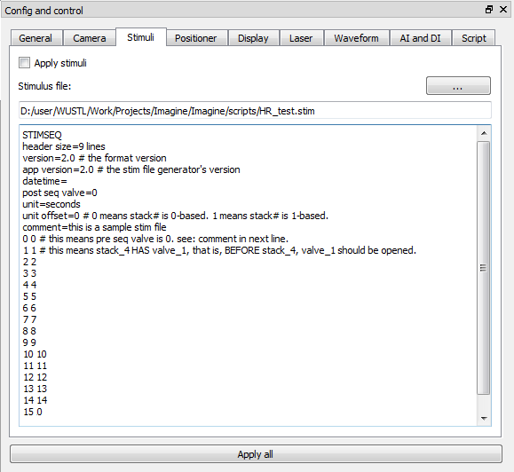

- Stimulus file : selects a .stim file. Then, Imagine will display the specified stimuli discription in the editing window and generate stimuli table listed in the Stimuli window.
- Apply stimuli : applies the stimuli table.

this figure, 'HR_test.stim' file is loaded, which shows an example descrition of stimuli. Here, several pairs of numbers are listed. The left number is a stack number and the right number is a stimulus number. If "Apply stimuli" is enabled, the stimulus number will be encoded with a 4-bit binary number and then each bits will be used to generate TTL pulses to channel P0.0 ~ P0.3.

4. Display tab
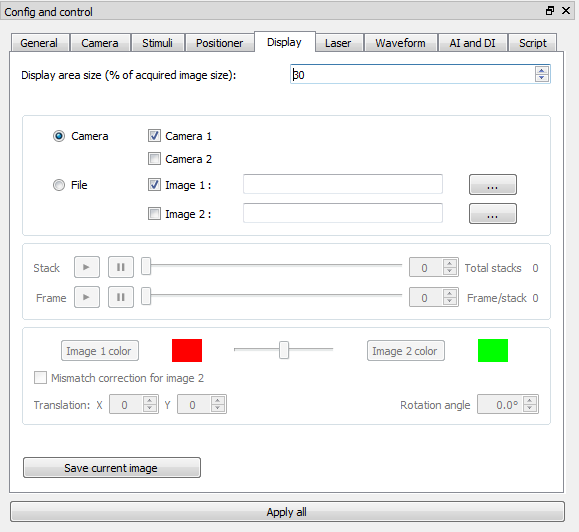

- Display area size : scales the display size.
- Camera and File choose radio button : chooses which images to display between images form cameras or captured images from .imagine file. And, we can display images from two cameras in one display window by overlapping them with different colors or in two windows separately.
- Mismatch correction for image 2 : helps to find mismatch paramters between the two overlapped images. When we capture images from two cameras, usually mismatch happens because of the difference between two optical paths to the cameras. We can correct the mismatch between overlapped images in the display window by changing "Translation X","Translation Y" and "Rotation angle" spinbox values. Once a user find well matched parameters with these spinboxes, the user should do the actual correction with those parameters in following analysis with separate tools. Imagine does not do the actual mismatch correction to the data. If this mismatch correction is performed before acqusition, these parameters wil be saved in the .imagine output file.
- Save current image : takes a snapshot of current display window.

5. Laser tab
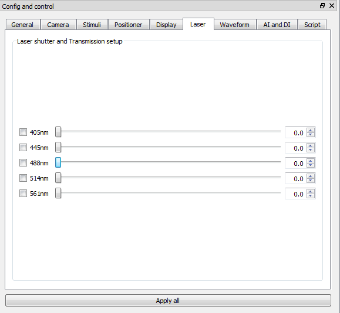

The laser module of OCPI-2 has five different wavelengths. We can turn on and off an individual laser by checking the checkbox beside which the wavelength is labled. The power of the laser can be also adjusted with slide bars and spinboxes. During the laser setting, we need to open the main laser shutter by clicking the "Open Shutter" button in the main menu. If we use waveform control mode, we can control the each shutters of the five individual wavelengths differently.

6. Waveform tab
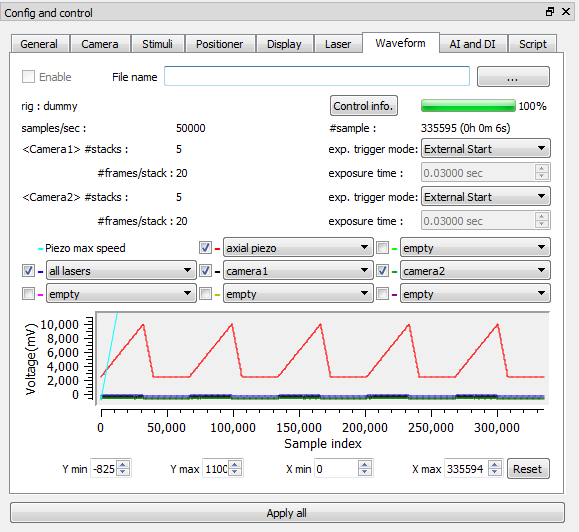

- Enable : makes the waveform control mode enable. If disalbed, the parameter control mode is selected.
- File name :selects a .json custom waveform file.
- Control info. : brings up pop up window which includes a list of control names and assigned DAQ channels.
- exp. trigger mode : selects a exp. trigger mode of this waveform control.
- waveform display controls : enables us to select which waverform and to set a x axis interval or a y interval to display (only display purpose).

7. AI and DI tab
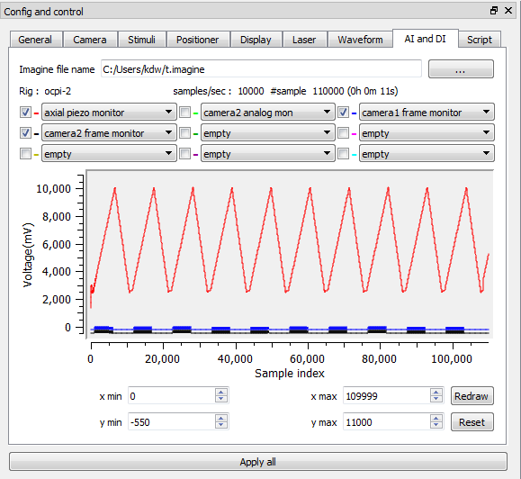

Imagine file name : selects a .imagine file. Then, Imagine will load .ai and .di file which include data of analog input signals and digital input signals respectively.
Waveform display controls : enables us to select which waverform and to set a x axis interval(x min, x max) or a y axis interval(y min, y max) to display. Notice the "Redraw" button. Different from the waveform display control in "waveform" tab, the waveform display window will be updated only when we press this button for the x interval change.

8. Script tab
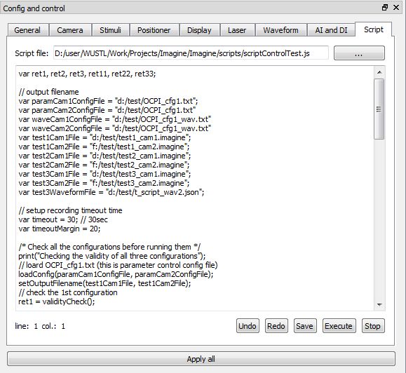

Script file : selects a .jl script file. Then, Imagine will display the specified script in the editing window
Undo : undoes the last change in the editing window.
Redo : redoes the last undo in the editing window.
Save : saves the script in the editing window to .jl file.
Execute : executes the script in the editing window.
Stop : stops the execution.

In this figure, 'scriptControlTest.js' file is loaded, which shows example script descriptions.

2. Script control mode
In the script control mode, we can execute a java script code in the Imagine. In addition, Imagine provides several java functions for user to access some essential operations which are used to record data. Thereby, we can execute several experiments according to the control flow specified with java script code by one execution without intervention.

In the Imagine GUI, general settings, parameter control settings and .json file name for waveform control can be saved in an configuration file with a ‘save configuration’ command in file menu. In script control mode, we can load, verify and record with this configuration file.

(1) System functions provided by the Imagine
print()
prints string to the log terminal.

ex) print("Hello world!");

validityCheck()
applies loaded configuration to data acquisition task and checks the validity of config files. This works as if we press a ‘Apply all’ button in the Imagine GUI after loading configuration files if these files are specified.

ex) var isOK = validityCheck("OCPI_cfg1.txt", "OCPI_cfg2.txt"); var isOK = validityCheck();

applyConfiguration()
This works same as validityCheck() function.

ex) applyConfiguration();

record()
begins to record. This works as if we press a ‘Record’ button in the Imagine GUI after loading configuration files if these are specifies. If configuration files are not specified, this just records according to the current configuration. This function return ‘false’ if execution time passes ‘timeout’ time, otherwise return ‘true.

ex) var isSucceed = record("OCPI_cfg1.txt", "OCPI_cfg2.txt", timeout); var isSucceed = record(timeout);

loadConfig()
loads configuration files.

ex) loadConfig("OCPI_cfg1.txt", "OCPI_cfg2.txt"); loadConfig("OCPI_cfg1.txt“);

loadWaveform()
loads a waveform file.

ex) loadWaveform("OCPI_waveform.json");

sleepms()
makes the script execution sleep specified times in milisecond.

ex) sleepms(1000); // sleep 1000msec

setOutputFilename()
changes output file names with specified file names.

ex) setOutputFilename("t1.imagine","t2.imagine"); setOutputFilename("t1.imagine");

getEstimatedRunTime()
returns estimated recording time in second. This time is calculated from total sample number of waveform signal. Therefore, it would take more time in actual acquisition which requires additional preparing and finishing times. These overhead times are less than 30sec in total.

ex) var time = getEstimatedRunTime();

stopRecord()
stop recording. This function is useful to get a control again when the Imagine lose a control after record() is fail.

ex) stopRecord();

getTimeElapsed(int dt)
return various elapsed times according to 'dt' value.

0: record start to DAQ pulses output start

1: DAQ pulses output start to DAQ pulses output end

2: DAQ pulses output end to recording end

3: current time

ex) total_elapsed_time = getTimeElapsed(0) + getTimeElapsed(1) + getTimeElapsed(2);

ex) function current_time() {return getTimeElapsed(3);}

(2) Javascript objects
We can also use existing javascript objects.

ex) print(Math.sqrt(64)+Math.abs(-1)+Math.log(10));

(3) Example

```javascript
var ret1, ret2, ret3, ret11, ret22, ret33;

// output filename
var paramCam1ConfigFile = "d:/test/OCPI_cfg1.txt";
var paramCam2ConfigFile = "d:/test/OCPI_cfg1.txt"
var waveCam1ConfigFile = "d:/test/OCPI_cfg1_wav.txt"
var waveCam2ConfigFile = "d:/test/OCPI_cfg1_wav.txt"
var test1Cam1File = "d:/test/test1_cam1.imagine";
var test1Cam2File = "f:/test/test1_cam2.imagine";
var test2Cam1File = "d:/test/test2_cam1.imagine";
var test2Cam2File = "f:/test/test2_cam2.imagine";
var test3Cam1File = "d:/test/test3_cam1.imagine";
var test3Cam2File = "f:/test/test3_cam2.imagine";
var test3WaveformFile = "d:/test/t_script_wav2.json";

// setup recording timeout time
var timeout = 30; // 30sec
var timeoutMargin = 20;

/* Check all the configurations before running them */
print("Checking the validity of all three configurations");
// loard OCPI_cfg1.txt (this is parameter control config file)
loadConfig(paramCam1ConfigFile, paramCam2ConfigFile);
setOutputFilename(test1Cam1File, test1Cam2File);
// check the 1st configuration
ret1 = validityCheck();

// OCPI_cfg1_wav.txt (waveform control : t_script_wav.json is specified in)
loadConfig(waveCam1ConfigFile, waveCam2ConfigFile);
setOutputFilename(test2Cam1File, test2Cam2File);
// check the 2nd configuration
ret2 = validityCheck();

// replace t_script_wav.json with t_script_wav2.json
ret3 = loadWaveform(test3WaveformFile);
setOutputFilename(test3Cam1File, test3Cam2File);
// check the 3rd configuration
ret3 = validityCheck();

/* Execute all the configurations */
if(ret1 && ret2 && ret3) { // If all the configurations are valid

    var estimatedRunTime;
    // setup the 1st configuration
    print("Recoding the 1st configuration");
    loadConfig(paramCam1ConfigFile, paramCam2ConfigFile);
    setOutputFilename(test1Cam1File, test1Cam2File);
    applyConfiguration(); // this can be also used to apply this configuation to the system
    estimatedRunTime = getEstimatedRunTime();
    // Recording
    timeout = estimatedRunTime + timeoutMargin;
    ret11 =  record(timeout);
    if (!ret11) stopRecord();

    // sleep 3000 msec
    print("Waiting 3 seconds");
    sleepms(3000);

    // 2nd configuration
    print("Recoding the 2nd configuration");
    loadConfig(waveCam1ConfigFile, waveCam2ConfigFile);
    setOutputFilename(test2Cam1File, test2Cam2File);
    applyConfiguration();
    estimatedRunTime = getEstimatedRunTime();
    timeout = estimatedRunTime + timeoutMargin;
    ret22 = record(timeout);
    if (!ret22) stopRecord();

    // sleep 100000 msec
    print("Waiting 10 seconds");
    sleepms(10000);

    // 3rd configuration
    // If we are here, we already loaded OCPI_cfg1_wav.txt.
    // So, we just replace waveform file
    print("Recoding the 3rd configuration");
    ret3 = loadWaveform(test3WaveformFile) ;
    setOutputFilename(test3Cam1File, test3Cam2File);
    applyConfiguration();
    estimatedRunTime = getEstimatedRunTime();
    timeout = estimatedRunTime + timeoutMargin;
    ret33 = record(timeout);
    if (!ret33) stopRecord();
}

// Display execution results
print("All the recodings are finished");
var msg1 = "configuration 1 validity: "+ ret1 +", recording: " + ret11;
print(msg1);
var msg2 = "configuration 2 validity: "+ ret2 +", recording: " + ret22;
print(msg2);
var msg3 = "configuration 3 validity: "+ ret3 +", recording: " + ret33;
print(msg3);
```
